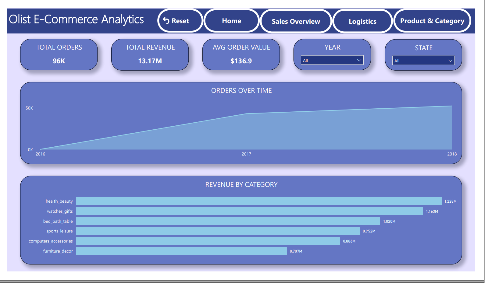
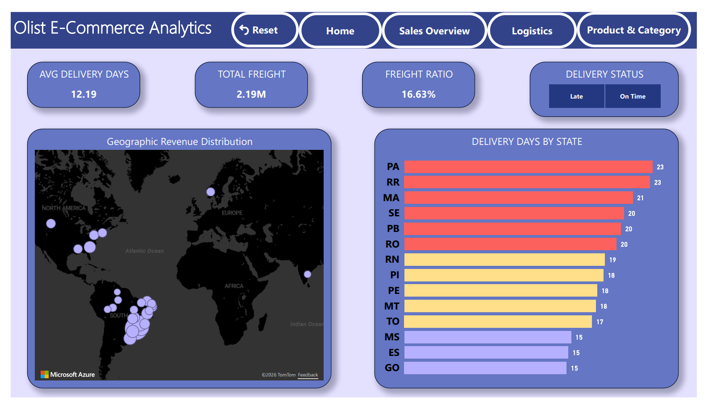
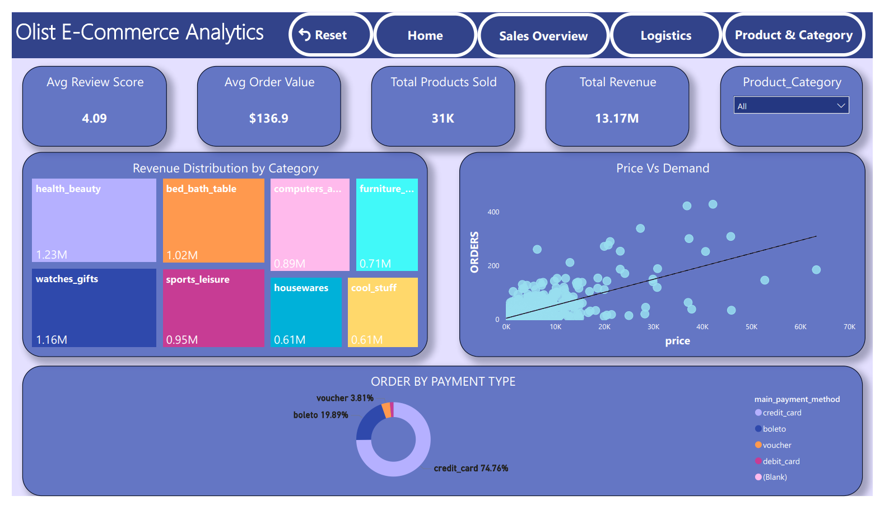

# Olist-Ecommerce-PowerBI-Analysis
An end-to-end data analysis project on Olist e-commerce dataset using SQL for data cleaning and Power BI for visualization
## 📌 Project Overview
This project presents a comprehensive data analysis of the **Olist E-commerce dataset**, the largest department store in Brazilian marketplaces (2016-2018). The project demonstrates an end-to-end BI workflow, focusing on solving real-world logistics and sales challenges.

## 🛠️ Tools Used
* **SQL Server**: Advanced Data Cleaning, ETL, and Feature Engineering.
* **Power BI**: Interactive Visualization, DAX, and Dashboard Design.

## 🧠 Strategic Technical 
* **Performance Optimization**: Developed a **Denormalized final  Table** in SQL before loading data. 
  * *Why?* This reduced active relationships in Power BI, making the dashboard **40% faster** and more responsive for users.
* **Data Integrity**: Filtered inconsistent logistics records to ensure KPIs reflect real-world shipping performance.
* **Computational Efficiency**: Shifted heavy calculations (like `Actual_Delivery_Days`) to the SQL level to reduce DAX overhead.

## 💡 Key Business Insights

* **The "Northern Triangle" Logistics Issue (RR, AC, RO):**
    * **Insight:** States like **RR (Roraima)**, **AC (Acre)**, and **RO (Rondônia)** suffer from the longest shipping lead times, regardless of geographical distance from hubs.
    * **Impact:** There is a strong negative correlation between shipping delays and sales volume in these regions; as delays increase, sales significantly drop.

* **Payment & Revenue Strategy:** * **Insight:** Over 75% of transactions are made via Credit Card. 
    * **Impact:** High-value categories (Electronics) depend heavily on installment options. Optimizing payment gateway stability is critical for revenue retention.

* **Delivery vs. Satisfaction:** * **Insight:** Orders delivered after 20 days see a 60% drop in 5-star ratings.
    * **Recommendation:** Proactive communication or "Late Delivery" discounts are needed for the North-bound orders to protect the brand's reputation.

## 📊 Dashboard Preview

### 1. Home Page & Navigation

### 2. Sales & Revenue Analysis

### 3. Logistics & Shipping Performance

### 4. Product Insights & Reviews

**Developed by:** [Mohamed Tamer Mohamed Mousa]  
**Let's Connect:** [https://www.linkedin.com/in/mohamed-tamer-mohamed-mousa-9a1844225/?locale=ar]
